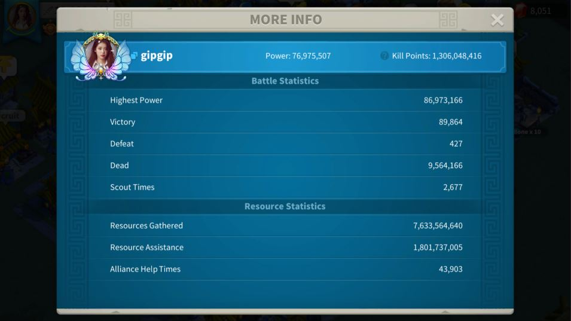
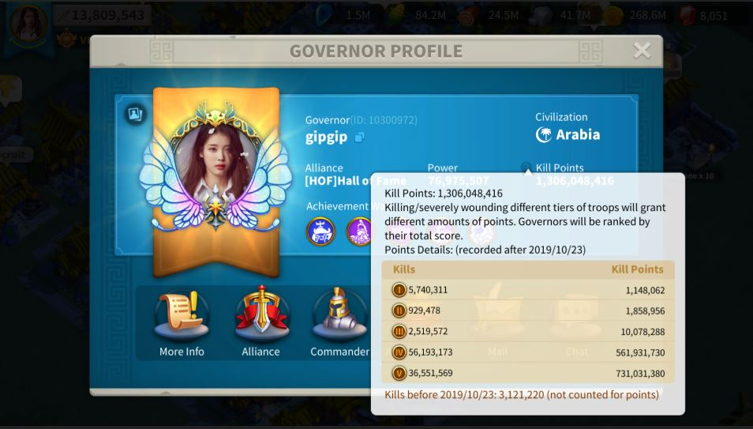
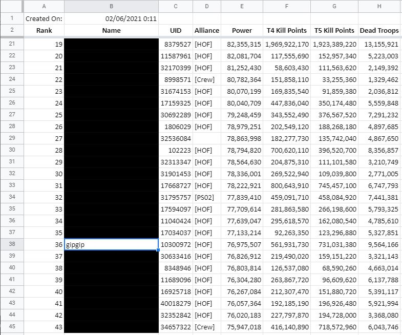

# ROK-Player-Stat-Aggregator

This program automates the process collecting in-game statistics of top 300 players in the kingdom.

## Description

This program goes through top 300 players and take screenshots of their statistics page. Then, OCR is performed on those screenshots and saves the data in a spread sheet. It saves hours of manual typing to just 30 minutes.

## Example Screenshots

The program takes two screenshots per player like the below images.

  

  

OCR is performed on above images, and useful data are exported in xlsx format.

  

## Dependencies

* pyautogui: Controls the mouse to navigate through top 300 players' statistic pages
* cv2: Enhances image for better OCR accuracy
* pytesseract: Converts image to string data
* openpyxl: Saves and formats the string data in xlsx format
